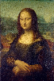

# PhotoMosiac
A photo mosaic program made with C++17 and SFML.  
Go to the [releases](https://github.com/MatthewJulian/PhotoMosiac/releases) tab to download.

# Sample
Here's a sample of the Mona Lisa, made with emojis.

Source Image  

Photo Mosaic  

